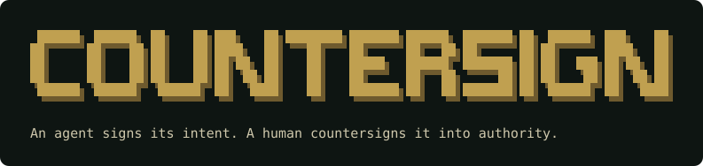
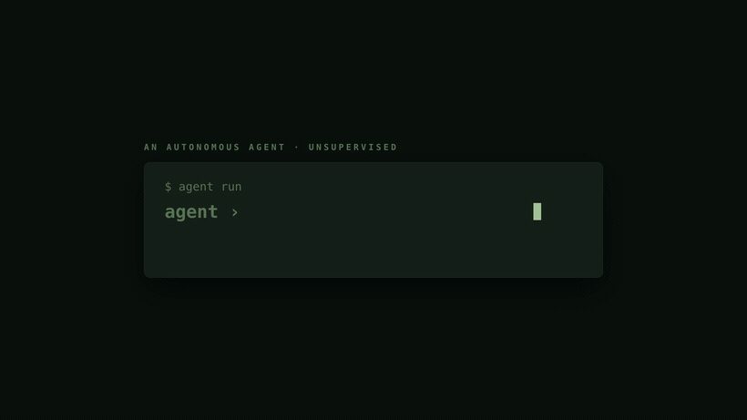

# counter-sign

**MCP gave agents tools. A2A gave agents colleagues. counter-sign gives agents a boss.**

[](assets/countersign-brag.mp4)

counter-sign is an open protocol for agent-to-human authorization: an agent
signs its intent; a human countersigns it into authority.

The agent stack has a missing leg. MCP standardizes **agent-to-tool**. A2A
standardizes **agent-to-agent**. Neither says what happens at the moment
that actually matters — when an agent is about to do something irreversible
and needs a human's yes, on whatever channel that human actually reads.
counter-sign standardizes **agent-to-human authority** with four nouns and
nothing else:

- **Intent** — a signed JSON envelope: what the agent wants to do, the risk
  tier, who may approve it, how many must approve (`quorum`, for two-person /
  M-of-N control), how long to wait, and what silence means.
- **Route** — delivery to where approvers live (Telegram, Discord, Slack,
  WhatsApp, email) via deliberately dumb, pluggable adapters.
- **Countersignature** — a signed, portable receipt of the decision,
  verifiable offline by any party. The only artifact that conveys authority.
- **Default** — declared timeout behavior. Silence is never ambiguous.

Read the spec: [spec/countersign-spec.md](spec/countersign-spec.md) (~3 pages).

## Quickstart

Add approval to any tool call in five lines:

```ts
import { wrapAction } from "counter-sign";
import { TelegramAdapter } from "counter-sign/adapters/telegram";

const deploy = wrapAction(deployProd,
  { action: "deploy.prod", summary: "Deploy v2.1.0 to production", risk_tier: "high",
    approvers: ["telegram:8675309"], timeout: 300, default: "reject" },
  new TelegramAdapter());
await deploy("v2.1.0");
```

On approve, `deployProd` runs. On reject — explicit or by timeout default —
it throws `IntentRejectedError` carrying the signed Countersignature as the
audit receipt. Try it with zero tokens:

```sh
npm install && npm run demo:local    # approver is you, at this terminal
npm run demo:email                   # full email flow, offline, no accounts
```

## Adapters

All five adapters implement one interface — `deliver(intent)` plus a
decision callback returning a `Countersignature` — and are configured via
env vars only (see [.env.example](.env.example) and
[adapters/README.md](adapters/README.md) for setup):

| Channel  | Setup effort | Interaction pattern |
| -------- | ------------ | ------------------- |
| Telegram | Low — a BotFather token | Buttons → callback webhook (or long-poll: no public URL needed) |
| Discord  | Medium — app + bot + public interactions endpoint | Buttons → interaction webhook (ed25519-verified) |
| Slack    | Medium — app, bot token, signing secret, public URL | Block Kit buttons → interactivity webhook (signature-verified) |
| WhatsApp | High — Meta app, approved template, webhook | Template quick-reply buttons → webhook (Meta Cloud API only) |
| Email    | Low — any SMTP credentials | Signed single-use links → confirm-page POST (GET never decides) |
| Local    | None | stdin approve/reject (demos, tests, CI) |

A Countersignature is byte-for-byte the same shape and equally verifiable
whichever adapter produced it — receipts don't care whether the yes came
from a chat button or an email link.

**Two-person / M-of-N approval.** Set `quorum: N` on an Intent to require N
*distinct* approvers before the action runs; any single approver vetoes. This
works on the chat channels and the local approver, where distinct people can
each respond (`npm run demo:quorum` shows a no-network two-person flow). The
single-recipient email flow supports `quorum: 1` only and refuses more.

## Why receipts, not booleans

An approval that evaporates after the `if` statement is worth nothing in an
audit. A Countersignature is ed25519-signed, names the actor and the policy
(explicit approver vs. timeout default), pins the exact `intent_id`, and
verifies offline with no access to the system that produced it. Timeout
defaults produce receipts too — silence has a signature here.

**Integrity is not authority.** A receipt that verifies against its *own*
embedded key only proves it wasn't tampered with — anyone can mint one. To
*act* on a receipt, bind it to the authority you trust:

```ts
import { verifyCountersignature } from "counter-sign";
// Only true if the receipt was signed by an authority key you trust:
verifyCountersignature(receipt, { trustedKeys: [OUR_AUTHORITY_PUBLIC_KEY] });
```

The `wrapAction` shim does this for you: it only accepts a decision signed by
the same authority key the runtime holds, so the adapter that collects the
decision must share that key (set `COUNTERSIGN_AUTHORITY_KEY`).

CLAIRE by Agentsstack Pte. Ltd. is the first reference deployment.

## Compliance and evidence

counter-sign gives regulated teams a machine-enforceable, auditable
human-oversight control — and the evidence auditors ask for: a signed,
portable record of who authorized a consequential action, under which rule,
and when, with optional two-person / M-of-N sign-off for the most sensitive
actions. It is a mechanism for *implementing* oversight — such as the human
oversight expected under EU AI Act Article 14 (Regulation (EU) 2024/1689) —
not a guarantee of compliance; a protocol produces evidence, while
organizations are what pass audits. See [COMPLIANCE.md](COMPLIANCE.md) for how
a Countersignature maps to control areas in SOC 2, ISO/IEC 27001, the NIST AI
RMF, and EU AI Act Article 14.

## Repository layout

| Path | What |
| ---- | ---- |
| `spec/` | The protocol specification (v0.1) |
| `schemas/` | JSON Schema (draft 2020-12) for Intent and Countersignature |
| `src/` | Reference implementation: core, shim, adapters (TypeScript, Node 20+, ESM) |
| `examples/` | One runnable demo per adapter + offline local/email demos |
| `adapters/` | Per-channel setup guides |

## Licensing

- **Code** (`src/`, `schemas/`, `examples/`, `tests/`): [Apache-2.0](LICENSE),
  Copyright 2026 Haridarman Kumaresan
- **Specification text** (`spec/`): CC BY 4.0 — see [LICENSE-CC-BY-4.0.txt](LICENSE-CC-BY-4.0.txt) (<https://creativecommons.org/licenses/by/4.0/>).
- Spec author: Haridarman Kumaresan.
- Sponsor: Agentsstack Pte. Ltd.
